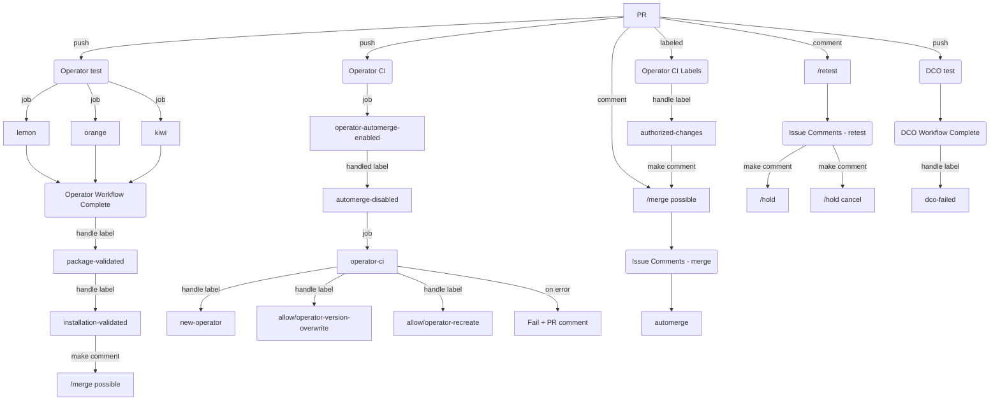
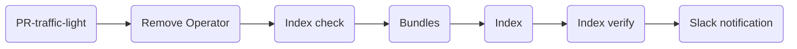
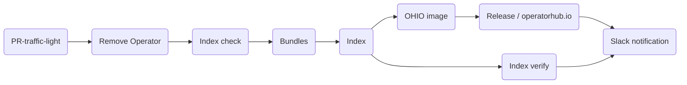

# Framework Overview

## Introduction

The goal of [the community operator pipeline framework project](https://github.com/redhat-openshift-ecosystem/community-operators-pipeline) is to deploy and configure pipelines for various flavors of Kubernetes or Openshift clusters and publish multiple versions of operator indexes.
GitHub projects via GitHub Action technology are supported. Currently, the following projects are supported:


## Codebase and development
| Name | Project| Barnches |
|------|--------|---------------|
|Framework|[https://github.com/redhat-openshift-ecosystem/community-operators-pipeline](https://github.com/redhat-openshift-ecosystem/community-operators-pipeline)|`ci/latest` and `ci/dev`|
|Ansible playbooks|[https://github.com/redhat-openshift-ecosystem/operator-test-playbooks](https://github.com/redhat-openshift-ecosystem/operator-test-playbooks)|`upstream-community` and `upstream-community-dev`|
|User and maintainer documentation ([k8s](https://k8s-operatorhub.github.io/community-operators/) and [ocp](https://redhat-openshift-ecosystem.github.io/community-operators-prod/))|[https://github.com/redhat-openshift-ecosystem/community-operators-pipeline](https://github.com/redhat-openshift-ecosystem/community-operators-pipeline)|`documentation`|
|[Admin Documentation](https://redhat-openshift-ecosystem.github.io/community-operators-pipeline/)|[https://github.com/redhat-openshift-ecosystem/community-operators-pipeline](https://github.com/redhat-openshift-ecosystem/community-operators-pipeline)|`documentation-admin`|


## Producion operator repositories
| Name | Project| Configuration |
|------|--------|---------------|
|Kubernetes operators ([OperatorHub.io](https://operatorhub.io/))|[https://github.com/k8s-operatorhub/community-operators](https://github.com/k8s-operatorhub/community-operators)|[pipeline-config.yaml](https://github.com/k8s-operatorhub/community-operators/blob/main/ci/pipeline-config-k8s.yaml)|
|OpenShift ([OCP](https://www.redhat.com/en/technologies/cloud-computing/openshift)) operators|[https://github.com/redhat-openshift-ecosystem/community-operators-prod](https://github.com/redhat-openshift-ecosystem/community-operators-prod)|[pipeline-config.yaml](https://github.com/redhat-openshift-ecosystem/community-operators-prod/blob/main/ci/pipeline-config-ocp.yaml)|
|Staging environment|[https://github.com/redhat-openshift-ecosystem/community-operators-pipeline](https://github.com/redhat-openshift-ecosystem/community-operators-pipeline)|[pipeline-config-k8s.yaml](https://github.com/redhat-openshift-ecosystem/community-operators-prod/blob/main/ci/pipeline-config-k8s.yaml) and [pipeline-config-ocp.yaml](https://github.com/redhat-openshift-ecosystem/community-operators-prod/blob/main/ci/pipeline-config-ocp.yaml)|

### Project structure
Each project should contain the following directory structure
```
$ tree -L 1 --sort=mtime -a
.
├── LICENSE
├── .github
├── categories.json
├── upstream.Dockerfile
├── scripts
├── .gitignore
├── docs
├── README.md
├── config.yaml
├── ci
├── operators
└── .git
```
The following table is describing each file or directory

| File | Description |
|------|--------|
|`README.md`|Main README file|
|`ci/`|Project CI configration directory|
|`operators/`|Directory contains all operators with the versions|
|`categories.json`|Config file with list of categories|
|`config.yaml`|Operator pipelines config file|
|`docs/`|Contains file with pull request predefined template (generated by the framework. Don't change!!!)|
|`.github/workflows`|Directory contains GitHub Action workflows (generated by the framework. Don't change!!!)|
|`upstream.Dockerfile`|Dockerfile needed for CI pipeline (generated by the framework. Don't change!!!)|
|`scripts/`|Temporary scripts directory (generated by the framework. Don't change!!!)|


### Testing Pipeline via GitHub Action

The testing pipeline flow chart is shown below


 [Download or edit](https://mermaid.live/edit#pako:eNqFlGFvmzAQhv-KxaQp04oGNNOkfJg0IESVJrXqJk0a6QcHX4IXYyPbNNog_30GTJJuzsYnm3te3713mNYrBAFv4W2ZOBQllhp9TdccmedTkD88Pk1r5PsfUVc3quxQHMzua5BYC4k0KP3GBSUXUHL3B8LwBhiQDqUvKPS5f6-c5y2DWZrcu_IVoqqA6w5lQf761fyDhB56ugKtRqgCuQNUC6XohoGFYwv_EJsuDoOcQSW4MxbmQmK-cwujfE8P1IaWY2gZDuV_E3LftxoloqqZKdR6yUYqC2d3SjXQh_tyFfLRaMdyq5FbObjBkcVM8QMXR-f2XkttzFh22kcv9-O2KzEnDNAwui6-bdsaF3u8A_8ZM0qwBnI8WsWtSzFvW8qVxoxhTQV3yOajrMJ7QNO84vfXx5VcdD0xE7FOfdxoMQh84NjgZOLDy7qILSyJ2vasIFQNkqmoJLrIEQXnJMU0YPPWYTeJwrblcPAnwflAN95Xwcx43p0yPINUfaOEWRwk1fC_I27_OkJCIQE7lIIjkFJIo5rnGaYMvUUPj1PXrbPUlSYNh3aVQtJfQHzzzzDXQE0J0tAxw1VgP94xuIryU79tpswly6LxqpaCkX9z4YlDBeYFsOnuhQ4DS9NpUgh_a1z3c_ZuPFNKhSkxv8G2F649XUIFa29hlgS2uGF67a15jzZ1_80uCTXt9RZbzBTceL2dLz954S20bGCCUop3Elcnqsb8uxDT_vgb-wq9ow){:target="_blank"}

### Release Pipeline via GitHub Action
The release pipeline flow charts are shown below
#### Openshift(ocp)

 [Download or edit](https://mermaid.live/edit#pako:eNo9j8tqAzEMRX_FaDWFDDSvLmZRSGkXhULLZFe8EbacMfFjcOS0IeTf6-K6Wkn3XAndK6ioCQYwLn6pCROLt1EGUWp3332MPSc0xqre2cPEd42Ivn8Uu2U3ko9nEu8zJeSYGl9Wvupeg6ZvoSZSx8ZWla27pxy0o1PT11Xf1J2mbqq6_bt0pmTNpcFthQ_d3qE6ihDZlleRbQzFAgvwlDxaXeJdf1ck8ESeJAyl1WQwO5Ygw61Y86yR6UXbEgMGg-5EC8DMcX8JCgZOmZrp2eIhof93zRg-Y2zz7QfnHGgI){:target="_blank"}

#### Kubernetes(k8s) with publishing index into [operatorhub.io](https://operatorhub.io/)



 [Download or edit](https://mermaid.live/edit#pako:eNpdkM1qwzAQhF9F6KRC3Mb5BR8KKS00UHBxbsWXrbSyRWTJyFLaEPLuVbGVQ3RazTfandWFciuQFlRq-8NbcJ58VLUh8ezm7LPKvAMpFc-0alr_kAjJsmeyy1mFnT0hKXt04K1LPB_5gu2NwF_CW-THxBYjW7KXYITGIenLUV-Nb5K6GtX1nJXv-5KoDhq8Z_k05oROyXOi6ynkJobUCAOSJ2KnnG34flQ2OTejccsOGviRGOtV3Bi8subWbNpoS2e0Q9eBEvHPLv-0pr7FDmtaxFKghKB9TWtzjdbQC_D4JlScSQsJesAZheDt4Ww4LbwLmEyvChoH3c3Vg_myNt2vfzEqfgM){:target="_blank"}


