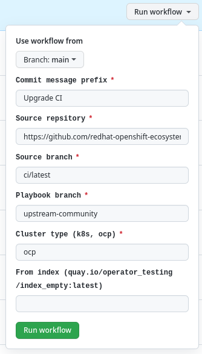

# Framework Overview

## TODO

- list of repos (Table)
- a simple example to upgrade a project
- project structure

## Introduction

The goal of [the community operator pipeline framework project](https://github.com/redhat-openshift-ecosystem/community-operators-pipeline) is to deploy and configure pipelines for various flavors of Kubernetes or Openshift clusters and publish multiple versions of operator indexes.
GitHub projects via GitHub Action technology are supported. Currently, the following projects are supported:


## Projects and configuration
| Name | Project| Configuration |
|------|--------|---------------|
|Kubernetes operators ([OperatorHub.io](https://operatorhub.io/))|[https://github.com/k8s-operatorhub/community-operators](https://github.com/k8s-operatorhub/community-operators)|[pipeline-config.yaml](https://github.com/k8s-operatorhub/community-operators/blob/main/ci/pipeline-config-k8s.yaml)|
|OpenShift ([OCP](https://www.redhat.com/en/technologies/cloud-computing/openshift)) operators|[https://github.com/redhat-openshift-ecosystem/community-operators-prod](https://github.com/redhat-openshift-ecosystem/community-operators-prod)|[pipeline-config.yaml](https://github.com/redhat-openshift-ecosystem/community-operators-prod/blob/main/ci/pipeline-config-ocp.yaml)|
|Framework and Staging environment|[https://github.com/redhat-openshift-ecosystem/community-operators-pipeline](https://github.com/redhat-openshift-ecosystem/community-operators-pipeline)|[pipeline-config-k8s.yaml](https://github.com/redhat-openshift-ecosystem/community-operators-prod/blob/main/ci/pipeline-config-k8s.yaml) and [pipeline-config-ocp.yaml](https://github.com/redhat-openshift-ecosystem/community-operators-prod/blob/main/ci/pipeline-config-ocp.yaml)|


### Project structure
The project administrator has to

- create an empty GitHub project
- configure one configuration file
- set up various secrets
- create the directory structure shown bellow

```
$ tree -L 1 --sort=mtime -a
.
├── LICENSE
├── .github
├── categories.json
├── upstream.Dockerfile
├── scripts
├── .gitignore
├── docs
├── README.md
├── config.yaml
├── ci
├── operators
└── .git
```
The following table is describing each file or directory

| File | Description |
|------|--------|
|`README.md`|Main README file|
|`ci/`|Project CI configration directory|
|`operators/`|Directory contains all operators with the versions|
|`categories.json`|Config file with list of categories|
|`config.yaml`|Operator pipelines config file|
|`docs/`|Contains file with pull request predefined template (generated by the framework. Don't change!!!)|
|`.github/workflows`|Directory contains GitHub Action workflows (generated by the framework. Don't change!!!)|
|`upstream.Dockerfile`|Dockerfile needed for CI pipeline (generated by the framework. Don't change!!!)|
|`scripts/`|Temporary scripts directory (generated by the framework. Don't change!!!)|

## Generate Github Action workflows

After directory setup is done and configurations are in place one can generate 

GitHub Actions



