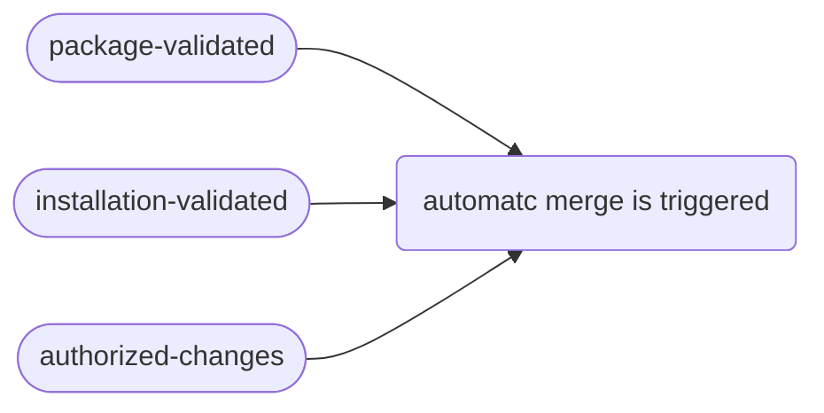
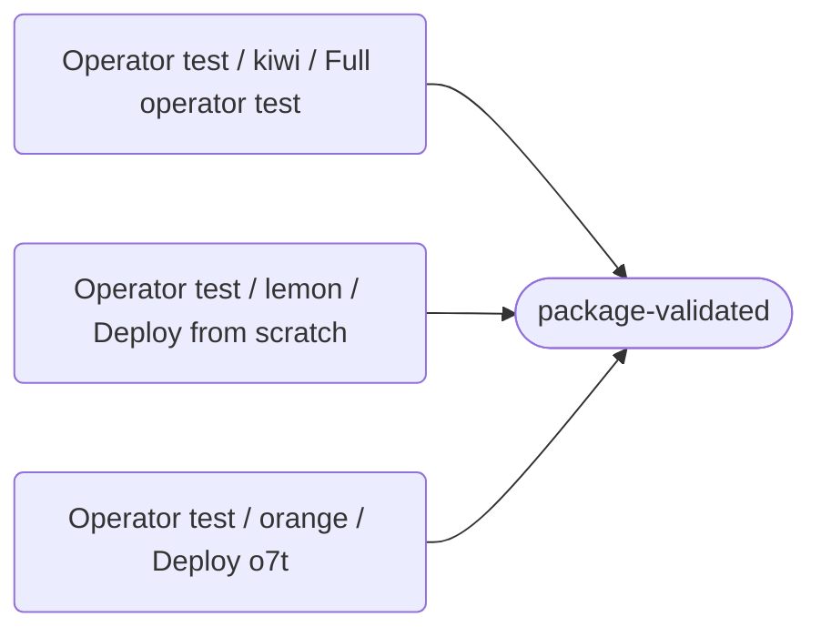
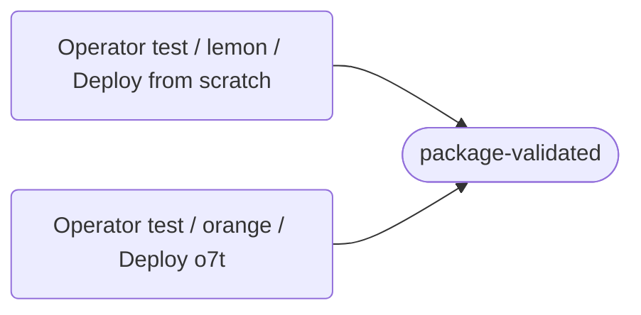
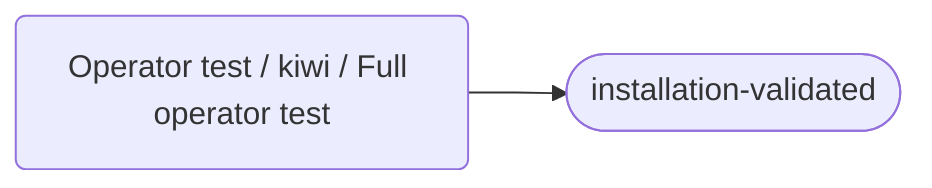
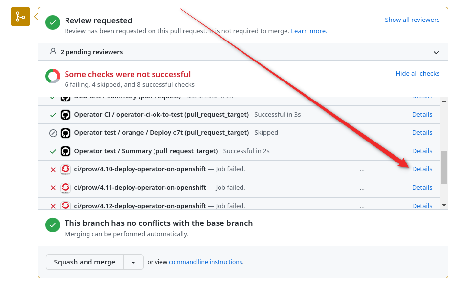
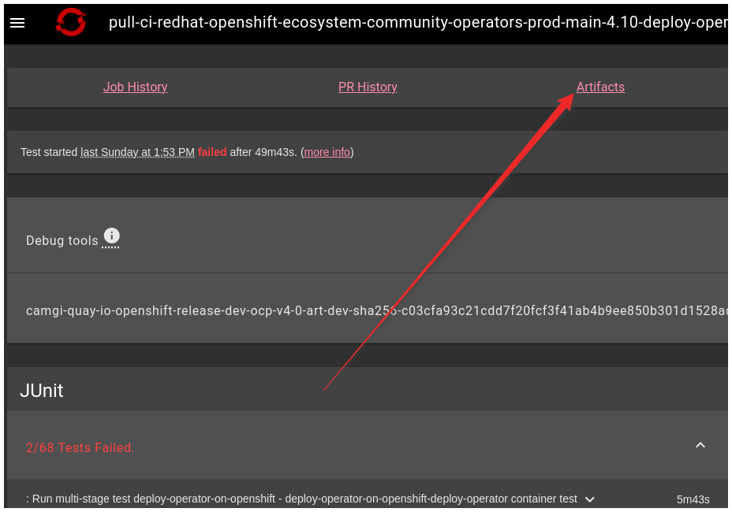
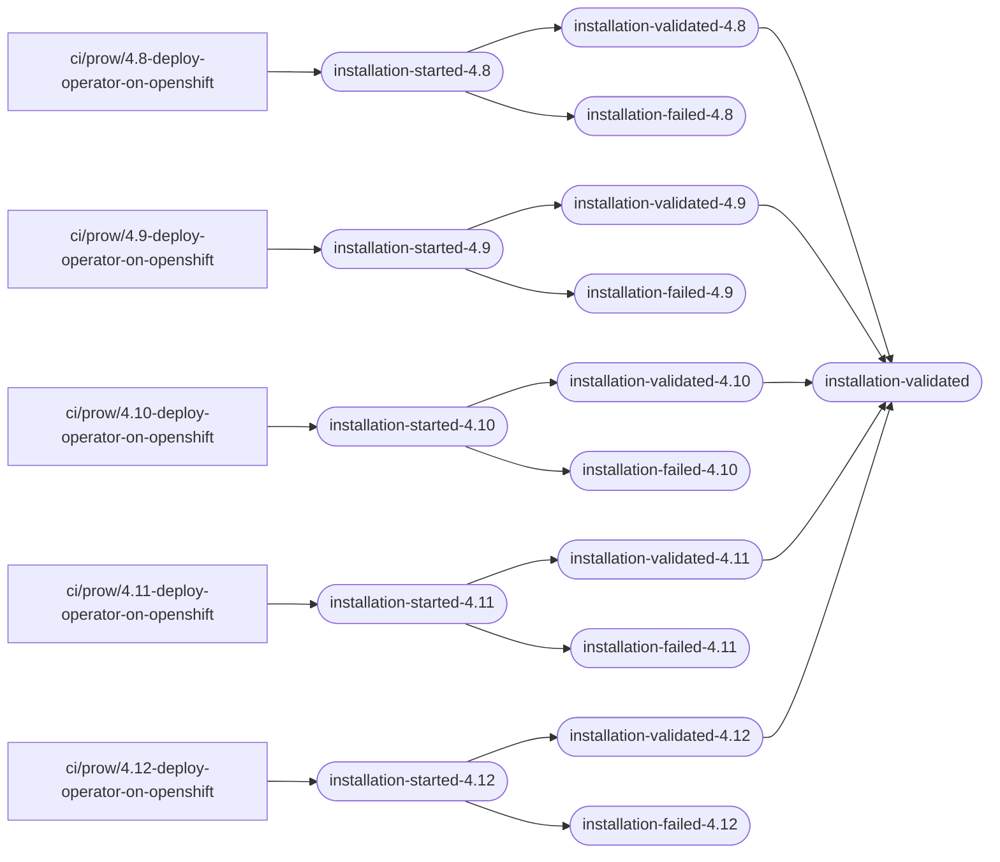
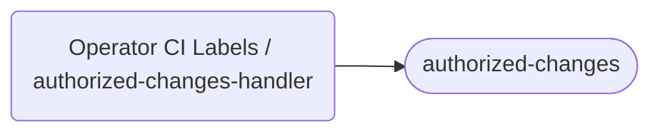
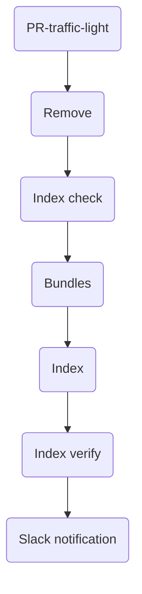

## Testing pipeline maintainer documentation


This documentation is focused on K8S operators. A maintainer is responsible for PR review on the following link [https://github.com/k8s-operatorhub/community-operators/pulls](https://github.com/k8s-operatorhub/community-operators/pulls)

This documentation is focused on OCP operators. A maintainer is responsible for PR review on the following link [https://github.com/redhat-openshift-ecosystem/community-operators-prod/pulls](https://github.com/redhat-openshift-ecosystem/community-operators-prod/pulls)

!!! info "The first part is related to the testing pipeline and how to get a PR green and merged. For failed operator release handling, please jump to [Release pipeline maintainer documentation](#release-pipeline-maintainer-documentation)."

### **Overview**

When a pull request (PR) is opened, tests are automatically triggered to ensure that it meets all quality standards. Tests produce labels. If the PR passes these tests, it is automatically merged, and the new operator is published to a specific index. 

!!! warning "Do use the `merge` button. It can cause a failed release. Always make PR green and it will be merged automatically. To restart a test use `/retest` comment or as a last resort close and reopen a PR."

For an automatic merge to be executed non of `*-failed` labels, but the following three labels must be present:

When a PR is opened, the original title is automatically replaced with a standardized one containing operator versions which were changed. There is also a flag in square braces indicating things like the single version will be overwritten including bundle delete and create and so on. More info in the [release pipeline section](#pr-flags). Don't worry about deleted bundles, there is still a copy available, so existing indexes will work as designed.

We will go over situations when some label is missing or something went wrong in the following paragraphs.

### **The package-validated label is missing**



 


To ensure that a release pipeline will not fail, a simulated local release is triggered. It is executing the same steps as sharp lease, the only difference is that everything is happening locally and not pushing to any official registry.

When a simulated release to an index was successful, the label `package-validated` is applied.

There are three tests as described below.

#### Orange test
Simulating a release of an affected operator to the current index(es). Helpful to prevent future failures on current indexes.

#### Lemon test
It catches incompatibilities in a release of a new index from scratch. Orange, lemon  and kiwi  have to obtain `package-validated` label.

#### Kiwi test
Basic checks like linting.
 
In k8s pipeline, it is also testing operator installation and will apply `installation-validated` label. 


### **The installation-validated label is missing**
This means that the pipeline can install the operator.

 

For K8S it is executed during a kiwi test.


For OCP, prow jobs for every supported OCP are triggered.

#### Prow job
For every index we support, a dedicated cluster is started and we are testing if operator installation without any problems. If the operator will not be released to some cluster, an installation test is not needed. In this case, a specific installation test passes early without any installation attempt.

To debug a red prow job go to `Details -> Artifacts -> artifacts/deploy-operator-on-openshift/deploy-operator/build-log.txt`

When all supported OCP clusters are green a label `installation-validated` is applied.

##### The label `openshift-started-<VERSION>` is present after a couple of hours

In case of `openshift-started-<VERSION>` label is present and prow job is not running, it means that the temporary index was triggered but not finished and failed due to some reason. You can inspect it on [`Actions -> Prepare Test Index`](https://github.com/redhat-openshift-ecosystem/community-operators-prod/actions/workflows/prepare_test_index.yaml).


### **The authorized-changes label is missing**

There are a few reasons why the `authorized-changes` label may be missing from a PR:

#### New-operator label is present

If the `new-operator` label is present, the following steps should be taken:

1. Copy the contents of the `clusterserviceversion.yaml` file to [https://operatorhub.io/preview](https://operatorhub.io/preview)
2. Visually inspect the content to ensure that it looks correct and that all fields on the right do not contain `N/A`, except for the channel field. The channel field cannot display any information.

#### No reviewer in `ci.yaml` file

If the `authorized-changes` label is missing and the `ci.yaml` file does not include a reviewer, the following step should be taken:

- Apply the authorized-changes label to the PR.

#### An author is not in the reviewer list in `ci.yaml` and `ci.yaml` file was not modified

If the `@contributor_name please approve` message is displayed, indicating that the author of the PR is not in the reviewer list in the `ci.yaml` file and the `ci.yaml` file has not been modified, the following steps should be taken:

1. Wait for approval from a reviewer who is listed in the `ci.yaml` file.
2. If the `authorized-changes` label is not set after the approval, follow one of the three options documented [here](https://redhat-openshift-ecosystem.github.io/community-operators-prod/self-merge-updates/#how-can-i-approve-a-pr-against-my-operator) to set it.

#### An author is not in the reviewer list in `ci.yaml` and `ci.yaml` file is modified

If the `/hold Please note that ci.yaml was changed` message is displayed, indicating that the author of the PR is not in the reviewer list in the `ci.yaml` file and the `ci.yaml` file has been modified, the following steps should be taken:

1. Wait for approval from a reviewer who is listed in the `ci.yaml` file.
2. If necessary, add the `/unhold` command to the PR to trigger the worklfow.
3. If the `authorized-changes` label is not set after approval, follow one of the three options documented [here](https://redhat-openshift-ecosystem.github.io/community-operators-prod/self-merge-updates/#how-can-i-approve-a-pr-against-my-operator).

### **Changes to an existing operator**
In an ideal world, a contributor is opening a new PR with a new operator version every time. However, in reality, the contributor needs to update an existing operator in rare cases. A current pipeline allows it because it always removes an existing package from an index and also creates a new bundle with the same tag if needed.

In general, it is not recommended to overwrite an existing operator version. But if there is some typo in the description or something cosmetic. 

The current setup allows cosmetic changes defined in [`local.yml`](https://github.com/redhat-openshift-ecosystem/operator-test-playbooks/blob/upstream-community/upstream/local.yml) as `dc_changes_allowed` variable.

Pipeline detects a cosmetic change and removes the whole package from an index, then adds the package in the current state containing already changed (new) bundles.

In some cases, a contributor may have a strong reason to make more significant changes to an existing operator. When a maintainer decides that this reason is valid an exception can be made. Applying `allow/serious-changes-to-existing` label will not fail on noncosmetic change then.

### **DCO failed**
The pipeline is checking if every commit is signed. This is an easy fix, just follow the steps under `Details` belonging to DCO test.

### **Everything is green but not merged**
There can be a case when `do-not-merge/hold` label is present. If the `openshift-robot` has added it, please remove it. If a contributor has added it, ask for removal. 

## Release pipeline maintainer documentation

When all conditions are met, the operator has merged automatically and a release pipeline is triggered at  [https://github.com/k8s-operatorhub/community-operators/actions/workflows/operator_release.yaml](https://github.com/k8s-operatorhub/community-operators/actions/workflows/operator_release.yaml).  [https://github.com/redhat-openshift-ecosystem/community-operators-prod/actions/workflows/operator_release.yaml](https://github.com/redhat-openshift-ecosystem/community-operators-prod/actions/workflows/operator_release.yaml).   

The release pipeline is not just releasing a single merged operator. Rather it is based on synchronization. So after merging multiple operators at once. Despite the operators being in different PRs, the first release will detect differences and sync every missing operator to related indexes.

### PR flags

Every release pipeline run is named by an operator name, the version in brackets and one of the following flags in square brackets:

- [N] - means a new operator, universal sync is executed
- [O] - operator-specific version overwrite, deleting bundles from repositories (copies are not deleted)
- [CI] - ci files changed, merging only
- [R] - operator-specific re-create, deleting all bundles in a package
- no flag - universal sync, restarting will automatically sync missing operators

In many cases, just a pipeline restart is needed. However, if a sync failed, any sync can be restarted to fix it. If `[O]` or`[R]` failed, you need to restart this specific run.

All releases have the same steps. The only difference for `[O]` or`[R]` flagged releases is that in `Remove` step there is an additional action:

-  `[O]` - delete a single bundle image from the registry and preserve copies
-  `[R]` - delete all bundle images related to the package and preserve copies

### Operators not released, only merged because of `installation_skip`

If there is some strong reason not to trigger a test and release, an operator is just merged. For example, operators named `ack*` have around 10 PRs opened at the same time. This merges 10 operators at the same time. In this case, 10 pipeline runs can be ineffective because we need just a single pipeline run to synchronize everything. 

!!! info "Operator with `installation-skipped` PR label is just merged and will be released with the next operator."

In rare cases, there is no other pipeline run triggered, please restart some pipeline run with no flag inside square braces.

### Placeholders to reserve an operator name for future PRs
If a contributor needs to reserve an operator name, it is possible to open a PR with just a `ci.yaml` file in an operator directory. Pipeline supports such functionality and skipping tests and release.

