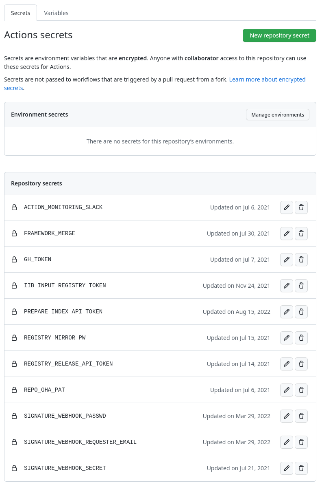

# Initialize new project

## TODO

- Project directory structure
- Secrets
- How to do first upgrade
- Test first operator

## Create empty project
The project administrator has to

- create an empty GitHub project
- configure one configuration file
- set up various secrets
- create the directory structure shown [here](/framework/overview/#project-structure)


## Configuration

The configuration file has to be stored in `$PROJECT_DIR/ci/pipeline-config.yaml`. There are three main sections

- production
- pipeline
- operatorhubio (for `k8s`)

Supported config options are explained for all sections below
### Production

```
production:
  type: ocp
  bundle:
    registry: quay.io
    organization: openshift-community-operators
  index:
    registry: quay.io
    organization: openshift-community-operators
    name: catalog_tmp
    tags:
      - v4.8-db
      - v4.9-db
      - v4.10-db
      - v4.11
      - v4.12
    signature:
      enabled: 1
      alias: registry.redhat.io/redhat/community-operator-index
      endpoint: https://community-signing-pipeline-prod.apps.pipelines-prod.ijdb.p1.openshiftapps.com
  mirror:
    enabled: 1
    multiarch:
      base: registry.redhat.io/openshift4/ose-operator-registry
      base_tags:
        - v4.5
        - v4.6
        - v4.7
        - v4.8
        - v4.9
        - v4.10
        - v4.11
      postfix: s
    registry: quay.io
    organization: redhat
    name: redhat----community-operator-index
    username:
      in: mavala
      out: redhat+iib_community
  test:
    installation_skip:
      - ack-
      - community-windows-machine-config-operator
```


|Name|Description|Possible options|
|----|----|----|
|`production.type`| Cluster type| `k8s` or `ocp`|
|`production.bundle`| Registry and organization for bundles| `registry` and `organization`|
|`production.index`| Registry, organization and for temporary index| `registry`, `organization` and `name`|
|`production.index.tags`| List of index tags| `latest` for `k8s` and `v4.8-db, v4.9-db, v4.10-db, v4.11, v4.12` for `ocp`|
|`production.index.signature`| Alias and endpoint to sign index image| `enabled`, `alias` and `endpoint`|
|`production.mirror`| Production index setup | `enabled`, `registry`, `organization` and `name`|
|`production.mirror.base`| From image used for index | `enabled`, `registry`, `organization` and `name`|
|`production.mirror.base_tags`| List of tags used for from index. (When not exist most recent used) | `v4.5 ... v4.11`|
|`production.mirror.postfix`| Type of index used for production | tag index: `<empty>` or sha index:`s`|
|`production.mirror.username.in`| Credential username used for accessing `registry.redhat.io` | |
|`production.mirror.username.out`| Credential username used for pushing to production registry | |
|`production.test.installation_skip`| List of projects that installation test will be skipped | multiple operator names (eg. `ack-` is for operators starting with `ack-`) |

### Pipeline

```
pipeline:
  base: https://github.com
  repo: k8s-operatorhub/community-operators
  branch: main
  ci_scripts_dir: https://raw.githubusercontent.com/redhat-openshift-ecosystem/community-operators-pipeline/ci/latest/ci/scripts
  image: quay.io/operator_testing/operator-test-playbooks:latest
  playbooks:
    repo: https://github.com/redhat-openshift-ecosystem/operator-test-playbooks
    branch: "upstream-community"
  automerge:
    enabled: 1
  reviewers:
    enabled: 1
  notifications:
    slack: 1
```

|Name|Description|Possble options|
|----|----|----|
|`pipeline.base`| GitHub project base | `https://github.com` |
|`pipeline.repo`| GitHub project org/repo | eg. `k8s-operatorhub/community-operators` |
|`pipeline.branch`| GitHub project branch used for operators | eg. `main` |
|`pipeline.ci_scripts_dir`| Location of framework ci scripts | using `ci/latest` branch |
|`pipeline.image`| Image used for container that tests and release | `quay.io/operator_testing/operator-test-playbooks:latest` or `quay.io/operator_testing/operator-test-playbooks:dev` |
|`pipeline.playbooks`| Playbook repo used as default | `repo` and `branch` |
|`pipeline.automerge`| Flag if automerge is enabled | `enabled` |
|`pipeline.reviewers`| Flag if reviewers is enabled | `enabled` |
|`pipeline.notifications`| Flag if notifications is enabled | `slack` |

### Operatorhubio
```
operatorhubio:
  enabled: 1
  registry: quay.io
  organization: operator-framework
  name: upstream-community-operators
  tag: latest
```

|Name|Description|Value|
|----|----|----|
|`production.operatorhubio`| Index image used to generate `operatorhub.io` page| `enabled`, `registry`, `organization`, `name` and `tag`|

## Secrets

Screenshot of GitHub action secrets



The table is explaining  

|Name|Description|
|----|----|
|`ACTION_MONITORING_SLACK`| Slack webhook credentials |
|`FRAMEWORK_MERGE`| GitHub action token for `framework-automation` user to be able to automerge |
|`GH_TOKEN`| GitHub action token for `framework-automation` to produce statistics |
|`IIB_INPUT_REGISTRY_TOKEN`| Token for user `$IIB_INPUT_REGISTRY_USER` to be able to access `registry.redhat.io` |
|`PREPARE_INDEX_API_TOKEN`| Quay application Token (user: `$oauth`) used for preparing temporary index for prow jobs |
|`REGISTRY_MIRROR_PW`| Token for user `$REGISTRY_MIRROR_USER` to be able to push to production (mirror) index|
|`REGISTRY_RELEASE_API_TOKEN`| Quay application Token (user: `$oauth`) used for pushing to release index |
|`REPO_GHA_PAT`| GitHub access token (deprecated)|
|`OHIO_REGISTRY_TOKEN`| Quay application token (user: `$oauth`) to push index image used for `operatorhub.io` web page|
|`SIGNATURE_WEBHOOK_PASSWD`| Index signrature password   |
|`SIGNATURE_WEBHOOK_REQUESTER_EMAIL`| Index signrature requester email |
|`SIGNATURE_WEBHOOK_SECRET`| Index signrature secret |

## Generate Github Action workflows

!!! note
    On newly created projects one should copy the file ([upgrade.yaml](https://github.com/redhat-openshift-ecosystem/community-operators-pipeline/blob/main/.github/workflows/upgrade.yaml)) to `.github/workflows/upgrade.yaml` and push it into `main` branch so `CI Upgrade` workflow is enabled in the `Actions` tab in the GitHub project.

After the directory and configurations are in place one can generate all workflows by running [Upgrade Action](https://github.com/redhat-openshift-ecosystem/community-operators-pipeline/actions/workflows/upgrade.yaml) from the configured project. More details one can find [here](/project/maintain/#project-upgrade)

One can verify `Upgrade CI` GitHub Action. See screenshot below

