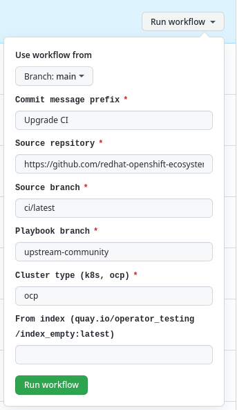

# Project maintain

## TODO
- How to upgrade

## Project upgrade

### GitHub Action - CI Upgrade
On every workflow template and config change, one has to run an upgrade to apply changes for each project.

| Name | Description |
|------|--------|
|`Commit message prefix`|Prefix added to commit message after upgrade|
|`Source repository`|Framework (workflow templates) project ([https://github.com/redhat-openshift-ecosystem/community-operators-pipeline](https://github.com/redhat-openshift-ecosystem/community-operators-pipeline))|
|`Source branch`|Framework (workflow templates) branch (`ci/latest`) |
|`Playbook branch`|Branch (`upstream-community`) in [ansible playbooks](https://github.com/redhat-openshift-ecosystem/operator-test-playbooks) are taken to upgrade|
|`Cluster type (k8s or ocp)`|Cluster type for repo. Possible options `k8s` or `ocp`|
|`From index (quay.io/operator_testing/index_empty:latest)`|Optional parameter to initialize or copy index image to nonexisten images|