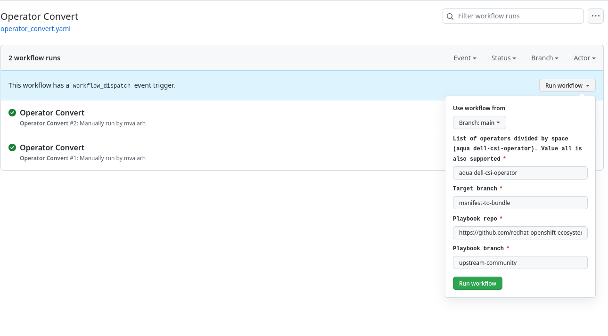

# Maintainance

## Labels

The operator project is using various labels to handle different situations. Here is the list of them and their meaning

| Name | Description |
|------|--------|
|`allow/operator-version-overwrite`| Operator version will be overritten (only cosmetics changes)|
|`allow/serious-changes-to-existing`|User is overwiting field in csv that are not allowed by default via previous label. Maintainer can allow these changes to be applied also.|
|`allow/operator-recreate`| Operator will be recreated (deleted/created). It happens when mutiple versions are modified of operator|
|`allow/ci-changes`| When there are changes outside of `operators` directory maintainer can set this label to skip failing|
|`allow/longer-deployment`| It sets longer time for operator installation timeout|
|`authorized-changes`| The changes are autorized. User can have this automatically when author is in reviever list in the `ci.yaml` file(needs for automerge)|
|`dco-failed`| DCO failed. Commits were not signedoff|
|`package-validated`| Package is validated (needs for automerge)|
|`installation-validated`| Installation is validated (needs for automerge)|
|`installation-skipped`| Installation is skipped. Some operators requested not to test installation |
|`needs-rebase`|User should rebase to latest `main` branch|
|`new-operator`|Label if operator is new. In other words if there is only one version of operator|

## Upgrade

### GitHub Action - CI Upgrade
On every workflow template and config change, one has to run an upgrade to apply changes for each project.

| Name | Description |
|------|--------|
|`Commit message prefix`|Prefix added to commit message after upgrade|
|`Source repository`|Framework (workflow templates) project ([https://github.com/redhat-openshift-ecosystem/community-operators-pipeline](https://github.com/redhat-openshift-ecosystem/community-operators-pipeline))|
|`Source branch`|Framework (workflow templates) branch (`ci/latest`) |
|`Playbook branch`|Branch (`upstream-community`) in [ansible playbooks](https://github.com/redhat-openshift-ecosystem/operator-test-playbooks) are taken to upgrade|
|`Cluster type (k8s or ocp)`|Cluster type for repo. Possible options `k8s` or `ocp`|
|`From index (quay.io/operator_testing/index_empty:latest)`|Optional parameter to initialize or copy index image to nonexisten images|

!!! warning "For https://github.com/redhat-openshift-ecosystem/community-operators-pipeline repository, there is a different `IIB_INPUT_REGISTRY_TOKEN` in k8s upgrade than in ocp upgrade. Change the token during the upgrade accordingly. Do *not* change any token in production, just on the development pipeline."

### GitHub Action - Operator convert
The goal of `Operator convert` workflow is to convert the package manifest format operator to a bundle. It is done in two steps

1. Convert operators to `target branch`
1. Make PR from `target branch` to `main`

!!! Warning "One can run multiple operators in one go, but be aware that the conversion process of the operator that has many versions might take a few hours. It is recommended to run more operators with a small number of versions first and then operators with many versions."

#### Disable package manifest format support
!!! warning "Since this process can take a long time, it is recommended to convert operators before the deadline (31. June 2023)."

!!! Info "Once the conversion process is finished and all operators are converted, one can disable the package manifest format by setting the configuration `pipeline package_manifest_disabled` value to `1` and run `CI Upgrade` explained above."

#### Package manifest format conversion workflow
The whole process can be run via the following workflow

| Name | Description |
|------|--------|
|`List of operators divided by space (aqua dell-csi-operator). Value all is also supported`|List of operators. Option `all` will search for all opeators that are in package manifest format|
|`Target branch`|Target branch where convertion of operator is pushed. One can make PR to man after process is finished. Note that branch is overwritten automatically by running next workflow if target branch is same.|
|`Playbook repo`|Playbook repo (`https://github.com/redhat-openshift-ecosystem/operator-test-playbooks`) |
|`Playbook branch`|Branch (`upstream-community`) in [ansible playbooks](https://github.com/redhat-openshift-ecosystem/operator-test-playbooks)|

