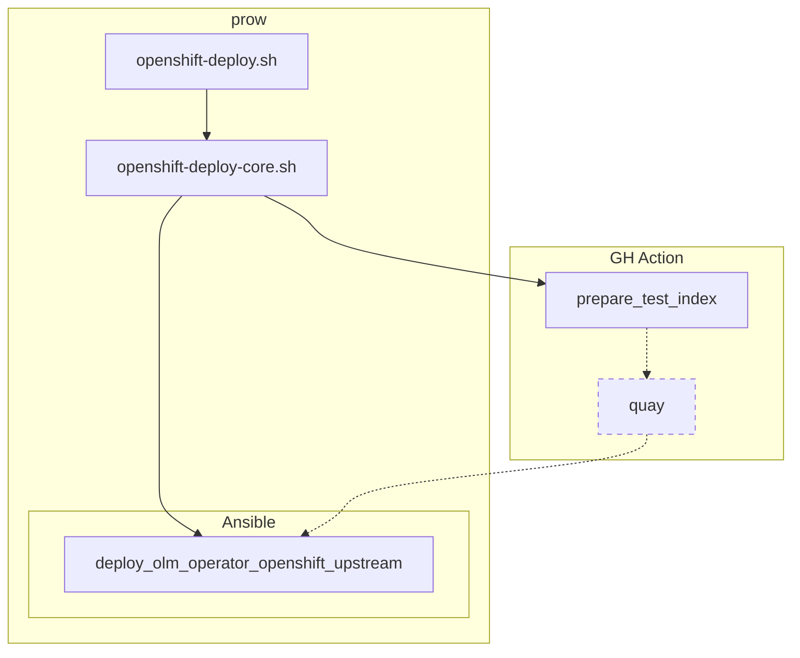

# OCP

The following part is related to Openshift only.
## TODO
- prow setup
  - Init prow
    - add robot to repo
  - PR to openshift repository
  - script and script dev
  - playbook
  - playbook dev and dev image
  - Temporary index action to check

## Overview
The prow job is automatically triggered for every OCP PR if GH Action did not fail at the beginning. See the structure below.

Openshift robot triggers cluster setup for every supported OCP version. When the cluster is ready, `openshift-deploy.sh` is executed. The script calls another script `openshift-deploy-core.sh` which triggers GH Action `prepare_test_index`. During the action run, it pushes the index and a bundle to Quay tagged by a commit hash. Once images are pushed, the playbook role `deploy_olm_operator_openshift_upstream` is triggered which pulls the images and installs the operator. 

### Where to edit the main openshift script 
To edit `openshift-deploy.sh` located in `ci/prow` of the project, first edit [openshift-deploy.sh](https://github.com/redhat-openshift-ecosystem/community-operators-pipeline/blob/ci/latest/ci/legacy/scripts/ci/openshift-deploy.sh) located in CI repository. Then upgrade the project running [Upgrade CI](overview.md#upgrade-ci). The same applies for `openshift-deploy-core.sh`.
!!! info "Consider using `ci/dev` instead of `ci/latest` during development as described [here](../framework/development.md#cidev-vs-cilatest)."

### Where to edit `deploy_olm_operator_openshift_upstream` role
Like every Ansible role, editing is possible in `upstream` directory of [ansible playbook repository](https://github.com/redhat-openshift-ecosystem/operator-test-playbooks/tree/upstream-community/upstream/roles/deploy_olm_operator_openshift_upstream). When using the production branch `upstream-community`, automatic playbook image build is triggered. When using the development branch `upstream-community-dev`, please trigger [playbook image build](https://github.com/redhat-openshift-ecosystem/operator-test-playbooks/actions/workflows/playbook_image.yml) manually as described [here](../framework/development.md#playbook-image-build).

!!! info "Consider using `upstream-community-dev` instead of `upstream-community` during development as described [here](../framework/development.md#upstream-community-dev-vs-upstream-community)."

### Where to edit or restart `prepare_test_index` action

To restart `prepare_test_index` action, go to [GH Actions](https://github.com/redhat-openshift-ecosystem/community-operators-prod/actions/workflows/prepare_test_index.yaml) of the project.

When an edit is needed, go to [templates](https://github.com/redhat-openshift-ecosystem/community-operators-pipeline/blob/ci/latest/ci/templates/workflow/prepare_test_index.yaml.js2).

!!! info "Consider using `ci/dev` instead of `ci/latest` during development as described [here](../framework/development.md#cidev-vs-cilatest)."

## How to edit prow building block configuration

Prow is configured at [openshift repository](https://github.com/openshift/release/tree/master/ci-operator/config/redhat-openshift-ecosystem/community-operators-prod). Open a PR and get `LGTM` approval from your colleague to get an automatic merge.

## Upgrade index

The example `Upgrade` pipeline is located [here](https://github.com/redhat-openshift-ecosystem/community-operators-prod/actions/runs/3739655547){:target="_blank"}. `Create local changes` step in `upgrade` job does whole process. Log is located [here](https://github.com/redhat-openshift-ecosystem/community-operators-prod/actions/runs/3739655547/jobs/6347120232) 

The example `Manual release` pipeline is located [here](https://github.com/redhat-openshift-ecosystem/community-operators-prod/actions/runs/3740100606){:target="_blank"}. ...[here](https://github.com/redhat-openshift-ecosystem/community-operators-prod/actions/runs/3740100606/jobs/6349116153){:target="_blank"}