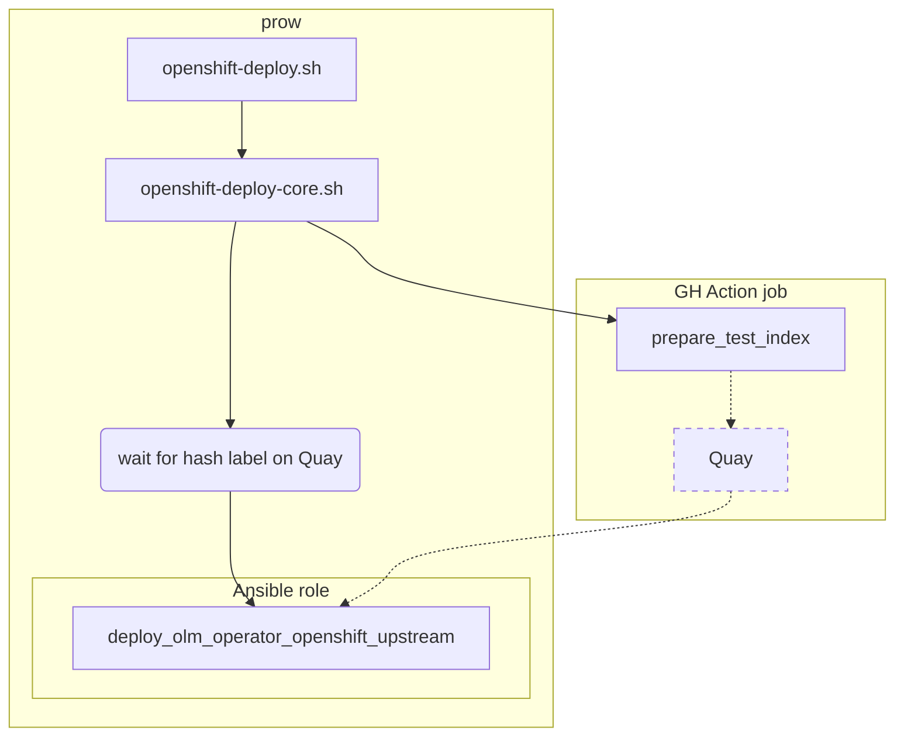

# OCP

## TODO
- ui max k8s
- latest
- where are bundles

The following part is related to Openshift only.

## How OCP installation is tested
Prow is an external OpenShift release tooling framework that is used as an installation test in the community pipeline.

### How to edit prow building block configuration

Prow is configured at [openshift repository](https://github.com/openshift/release/tree/master/ci-operator/config/redhat-openshift-ecosystem/community-operators-prod). Open a PR and get `LGTM` approval from your colleague to get an automatic merge.

In case you are creating a new project, make sure `openshift-ci-robot` is added as a collaborator to the project with `Admin` rights.

### Overview

The prow job is automatically triggered for every OCP PR if GH Action did not fail at the beginning. See the structure below.

Openshift robot triggers cluster setup for every supported OCP version. When the cluster is ready, `openshift-deploy.sh` is executed. The script calls another script `openshift-deploy-core.sh` which triggers GH Action `prepare_test_index`. During the action run, it pushes the index and a bundle to Quay tagged by a commit hash. Once images are pushed, the playbook role `deploy_olm_operator_openshift_upstream` is triggered which pulls the images and installs the operator. 

### Where to edit the main openshift script 
To edit `openshift-deploy.sh` located in `ci/prow` of the project, first edit [openshift-deploy.sh](https://github.com/redhat-openshift-ecosystem/community-operators-pipeline/blob/ci/latest/ci/legacy/scripts/ci/openshift-deploy.sh) located in CI repository. Then upgrade the project running [Upgrade CI](overview.md#upgrade-ci). The same applies for `openshift-deploy-core.sh`.
!!! info "Consider using `ci/dev` instead of `ci/latest` during development as described [here](../framework/development.md#cidev-vs-cilatest)."

### Where to edit `deploy_olm_operator_openshift_upstream` role
Like every Ansible role, editing is possible in `upstream` directory of [ansible playbook repository](https://github.com/redhat-openshift-ecosystem/operator-test-playbooks/tree/upstream-community/upstream/roles/deploy_olm_operator_openshift_upstream). When using the production branch `upstream-community`, automatic playbook image build is triggered. When using the development branch `upstream-community-dev`, please trigger [playbook image build](https://github.com/redhat-openshift-ecosystem/operator-test-playbooks/actions/workflows/playbook_image.yml) manually as described [here](../framework/development.md#playbook-image-build).

!!! info "Consider using `upstream-community-dev` instead of `upstream-community` during development as described [here](../framework/development.md#upstream-community-dev-vs-upstream-community)."

### Where to edit or restart `prepare_test_index` action

To restart `prepare_test_index` action, go to [GH Actions](https://github.com/redhat-openshift-ecosystem/community-operators-prod/actions/workflows/prepare_test_index.yaml) of the project.

When an edit is needed, go to [templates](https://github.com/redhat-openshift-ecosystem/community-operators-pipeline/blob/ci/latest/ci/templates/workflow/prepare_test_index.yaml.js2).

!!! info "Consider using `ci/dev` instead of `ci/latest` during development as described [here](../framework/development.md#cidev-vs-cilatest)."

## Release brand new index for OCP

Let's assume we are going to release the index for `OCP v{{ ocp_version_example }}`.
### Prerequisities

Before running an automatic GH action that creates indexes itself, there are some prerequisites administrator should prepare in a specific order:

1. Add new index mapping
1. Enable Pyxis support  for a specific index
1. Set maximum `oc` version available
1. OCP and K8S alignment
1. Enable breaking API testing if supported by `operator-sdk`
1. When all done, bump [`ocp_version_example`](https://github.com/redhat-openshift-ecosystem/community-operators-pipeline/blob/documentation-admin/mkdocs.yml#L19) variable so next time examples are up to date :)

### Add new index mapping
Always check and add the current index (e.g. `v{{ ocp_version_example }}`) version to

- `operator_info` role [defaults](https://github.com/redhat-openshift-ecosystem/operator-test-playbooks/blob/upstream-community/upstream/roles/operator_info/defaults/main.yml#L25) and to [k8s2ocp](https://github.com/redhat-openshift-ecosystem/operator-test-playbooks/blob/upstream-community/upstream/roles/bundle_validation_filter/defaults/main.yml#L16) and [ocp2k8s](https://github.com/redhat-openshift-ecosystem/operator-test-playbooks/blob/upstream-community/upstream/roles/bundle_validation_filter/defaults/main.yml#L31) converting tables in `bundle_validation_filter`
- [`OCP2K8S`](https://github.com/redhat-openshift-ecosystem/community-operators-pipeline/blob/ci/latest/ci/legacy/scripts/ci/openshift-deploy-core.sh#L27) and [`KIND_SUPPORT_TABLE`](https://github.com/redhat-openshift-ecosystem/community-operators-pipeline/blob/ci/latest/ci/scripts/opp-env.sh#L5) variable in ci/dev and ci/latest consequently

### Enable Pyxis support for a new index
To enable pyxis support for a specific index, clone the [issue](https://issues.redhat.com/browse/CWFHEALTH-1562). And update index number (e.g. `v{{ ocp_version_example }}`) in the description.

### Set maximum `oc` version available
Edit `oc_version_max` in playbook defaults only if `4.x` (e.g. `v{{ ocp_version_example }}`) is available at https://mirror.openshift.com/pub/openshift-v4/clients/ocp/latest-4.x/openshift-client-linux.tar.gz 

(e.g. https://mirror.openshift.com/pub/openshift-v4/clients/ocp/latest-{{ ocp_version_example }}/openshift-client-linux.tar.gz)

### OCP and K8S alignment
Despite this documentation being focused on OCP, alignment with k8s is needed on [community-operators **k8s-operatorhub**](https://github.com/k8s-operatorhub/community-operators) repository.

Firstly, set [`kind_version`](https://github.com/k8s-operatorhub/community-operators/blob/main/ci/pipeline-config-k8s.yaml#L63) to the latest `kind` according to https://github.com/kubernetes-sigs/kind/releases (e.g. v0.17.0). Also the same [page](https://github.com/kubernetes-sigs/kind/releases) contains semver version of a specific k8s image. So for `1.25` we are reading `v1.25.3`. Set the value as [`kind_kube_version`](https://github.com/k8s-operatorhub/community-operators/blob/main/ci/pipeline-config-k8s.yaml#L65).

#### Enable breaking API testing if supported by `operator-sdk`
If there is some breaking API in a new index (e.g. `v{{ ocp_version_example }}`), please edit [`bundle_validation_filter`](https://github.com/redhat-openshift-ecosystem/operator-test-playbooks/blob/upstream-community/upstream/roles/bundle_validation_filter/defaults/main.yml) role defaults to enable testing if API is broken in a specific operator.

### Release process

Firstly, the index must be defined in [`pipeline-config-ocp.yaml`](https://github.com/redhat-openshift-ecosystem/community-operators-prod/blob/main/ci/pipeline-config-ocp.yaml) file. There are old entries like `v4.10-db` where `-db` means index is in SQLlite format. It is just for the information, not important here. A new entry can be one of the following:
- `v{{ ocp_version_example }}-maintenance` - release the specific index will not be executed, `kiwi lemon orange` tests are always green, failed Prow is not blocking merge action
- `v{{ ocp_version_example }}-rc` - release the specific index will be executed, `kiwi lemon orange` tests are always green, failed Prow is not blocking merge action
- `v{{ ocp_version_example }}` - full production setup, needs all tests green before merge action

Admins are asked to provide a new Openshift index a couple of months before a new Openshift version is GA. There are 2 ways of releasing a new index.

The very first step is to have the entry in [`pipeline-config-ocp.yaml`](https://github.com/redhat-openshift-ecosystem/community-operators-prod/blob/main/ci/pipeline-config-ocp.yaml) like in the example: `- v{{ ocp_version_example }}-maintenance`. This is a label for the target index in case of a new index release.

### Release from a previous index

This is a recommended way. Much faster and easier to execute. Everything is managed by the automatic workflow called [`CI Upgrade`](https://github.com/redhat-openshift-ecosystem/community-operators-prod/actions/workflows/upgrade.yaml). Fill fields as shown below. The most important field is `From index`. There should be a path directly to a previous `_tmp` image. Use path like `quay.io/openshift-community-operators/catalog_tmp:v{{ ocp_previous_version_example }}` if you would like to release `v{{ ocp_version_example }}`.

When the workflow is finished, see the list of operators to fix in the new index. The list is located on the GH workflow output page as `Upgrade summary`.

The example `Upgrade` pipeline is located [here](https://github.com/redhat-openshift-ecosystem/community-operators-prod/actions/runs/3739655547){:target="_blank"}. `Create local changes` step in `upgrade` job does the whole process. The log is located [here](https://github.com/redhat-openshift-ecosystem/community-operators-prod/actions/runs/3739655547/jobs/6347120232) 

Then you need to fix operators by running [`Operator release manual`](https://github.com/redhat-openshift-ecosystem/community-operators-prod/actions/workflows/operator_release_manual.yaml). Set values as in the example below. The most important field is the `List of operators ...` - it is a place to put the output from the previous workflow under the `Upgrade summary`. The list is already space delimited.

The example `Manual release` pipeline schema is located [here](https://github.com/redhat-openshift-ecosystem/community-operators-prod/actions/runs/3740100606){:target="_blank"} and the example output with steps [here](https://github.com/redhat-openshift-ecosystem/community-operators-prod/actions/runs/3740100606/jobs/6349116153)](https://github.com/redhat-openshift-ecosystem/community-operators-prod/actions/runs/3740100606/jobs/6349116153){:target="_blank"}.

### How to rebuild an existing index from scratch

There can be cases when differences between an actual and a new index are huge. In this case, it makes sense to fill the new index from scratch. You need only [`Operator release manual`](https://github.com/redhat-openshift-ecosystem/community-operators-prod/actions/workflows/operator_release_manual.yaml). Be ready for a day or more and multiple manual triggers of the same workflow type with a different set of operators.

This time, a `List of operators...` is a list of all operators in the GitHub repository divided into chunks that can be processed in 6 hours or less each. Hence GH actions limit. The best practice is to use 1/5th of the full operator list divided by a space. 

A release process in this case is long this way so use it as a last resort. It can be partially optimized by running over operators sorted by the number of versions inside a package. It helps the parallel process to finish smaller operators sooner.

!!! warning "Do not enable `Push final index to production` until all operators are processed. Or you can always leave the value `0` and the next automatic merge will push also your changes to production."

!!! info "Release process is expected to fail at the end due to the fact, that index is not fully synchronized until all operators are processed. It is OK."