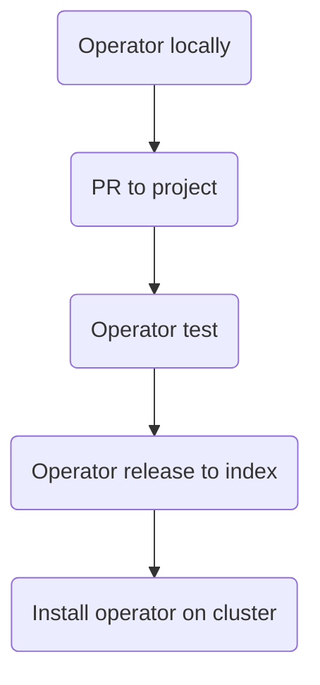

# Project Overview
The goal of the project is to test, release and deploy an operator to index so it is easily installable.

The process is displayed below.

Let's get started with [Project initialize](/project/init).